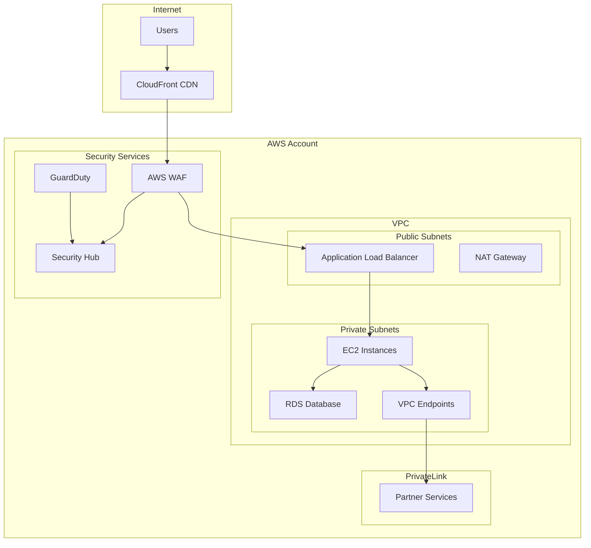

# Zero Trust Architecture Implementation

## Quick Start Guide

This repository implements a comprehensive Zero Trust Architecture (ZTA) for AWS-based utility grid management systems, following NIST SP 800-207 guidelines.

## 🔒 What is Zero Trust?

Zero Trust is a security paradigm that assumes no trust by default. Every user, device, and network flow is verified before granting access to systems and data.

### Core Principles
- **Never Trust, Always Verify**: Verify every user and device
- **Least Privilege Access**: Grant minimal necessary permissions
- **Assume Breach**: Design for when (not if) breaches occur

## 🏗️ Architecture Overview



## 🚀 Implementation Features

### ✅ Network Security
- **VPC Endpoints**: All AWS service traffic stays within AWS backbone
- **Security Groups**: Microsegmentation with least privilege
- **NACLs**: Additional layer of network filtering
- **VPC Flow Logs**: Complete network traffic visibility

### ✅ CloudFront with Zero Trust
- **Session-Aware Edge**: Lambda@Edge functions validate sessions
- **Security Headers**: Comprehensive HTTP security headers
- **Origin Access Control**: S3 and API Gateway protection
- **WAF Integration**: Advanced threat protection

### ✅ PrivateLink Connectivity
- **Secure External Access**: No internet exposure for partner integrations
- **DNS Resolution**: Private DNS for internal services
- **Traffic Monitoring**: Complete visibility into external connections

### ✅ Identity & Access Management
- **Fine-grained Permissions**: Resource-level access control
- **Multi-factor Authentication**: Required for all access
- **Session Management**: Continuous session validation
- **Certificate-based Auth**: mTLS for service-to-service communication

### ✅ Monitoring & Compliance
- **Comprehensive Logging**: All activities tracked and monitored
- **Real-time Alerting**: Immediate notification of security events
- **Automated Compliance**: Continuous compliance validation
- **Audit Trails**: Complete forensic capabilities

## 📁 Repository Structure

```
terraform/
├── modules/
│   ├── vpc/                    # Enhanced VPC with endpoints
│   ├── security/               # Zero Trust security groups
│   ├── cloudfront/            # Session-aware CloudFront
│   ├── privatelink/           # Secure external connectivity
│   └── monitoring/            # Security monitoring
├── main.tf                    # Root infrastructure configuration
└── variables.tf              # Configuration parameters

docs/
├── ZERO_TRUST_ARCHITECTURE.md # Detailed implementation guide
└── ARCHITECTURE.md            # Overall system architecture

supabase/
└── functions/                 # Edge functions for security
```

## 🛠️ Quick Deployment

### Prerequisites
- AWS CLI configured with appropriate permissions
- Terraform >= 1.0
- Domain name for SSL certificates (optional)

### 1. Clone and Configure
```bash
git clone <repository-url>
cd aws-utility-infrastructure
cp terraform/terraform.tfvars.example terraform/terraform.tfvars
```

### 2. Update Configuration
Edit `terraform/terraform.tfvars`:
```hcl
# Basic Configuration
project_name = "your-utility-system"
environment  = "prod"
aws_region   = "us-east-1"

# Zero Trust Configuration
enable_bastion = false                    # No direct SSH access
admin_cidr_blocks = ["203.0.113.0/24"]  # Your admin network
enable_waf = true                        # Enable WAF protection

# PrivateLink Configuration
partner_services = [
  {
    service_name = "com.amazonaws.vpce.us-east-1.vpce-svc-example"
    resource_arn = "arn:aws:execute-api:us-east-1:123456789012:api/*"
  }
]
```

### 3. Deploy Infrastructure
```bash
cd terraform
terraform init
terraform plan
terraform apply
```

### 4. Verify Deployment
```bash
# Check VPC endpoints
aws ec2 describe-vpc-endpoints --region us-east-1

# Verify security groups
aws ec2 describe-security-groups --region us-east-1

# Test CloudFront distribution
curl -I https://your-distribution.cloudfront.net
```

## 🔧 Configuration Options

### Security Configuration
```hcl
# Enable bastion host for emergency access
enable_bastion = true
admin_cidr_blocks = ["your-office-ip/32"]

# Configure partner services
partner_services = [
  {
    service_name = "partner-vpc-endpoint-service"
    resource_arn = "partner-api-gateway-arn"
  }
]

# Restrict PrivateLink access
privatelink_allowed_cidrs = [
  "10.0.0.0/8",
  "partner-vpc-cidr"
]
```

### Monitoring Configuration
```hcl
# Enable detailed monitoring
enable_detailed_monitoring = true
alert_email = "security-team@your-company.com"

# Configure backup retention
backup_retention_days = 30
```

## 🔍 Security Features Detail

### Network Microsegmentation
```
Security Group Rules:
├── ALB: Only CloudFront IPs → ALB:443
├── EC2: Only ALB → EC2:443,8080
├── RDS: Only EC2 → RDS:5432
└── VPC Endpoints: Only VPC CIDR → Endpoints:443
```

### Session Validation
Lambda@Edge functions provide:
- Session token validation
- User context verification
- Request origin validation
- Security header injection

### Continuous Monitoring
```
Monitoring Stack:
├── VPC Flow Logs → CloudWatch
├── CloudTrail → S3 + CloudWatch
├── Application Logs → CloudWatch
├── Security Events → Security Hub
└── Automated Alerts → SNS
```

## 📊 Monitoring Dashboard

Access your security dashboard at:
- **CloudWatch**: Real-time metrics and logs
- **Security Hub**: Centralized security findings
- **GuardDuty**: Threat detection insights
- **Config**: Compliance status

Key metrics to monitor:
- Failed authentication attempts
- Unusual network traffic patterns
- Policy violations
- Service health status

## 🚨 Security Alerts

Automated alerts are configured for:
- Authentication failures (>5 in 5 minutes)
- Unusual network patterns
- Policy violations
- Service outages
- Compliance drift

## 🔄 Maintenance

### Regular Tasks
- **Weekly**: Review security alerts and logs
- **Monthly**: Update security group rules if needed
- **Quarterly**: Review and rotate access keys
- **Annually**: Complete security architecture review

### Updates
```bash
# Update Terraform modules
terraform get -update

# Apply configuration changes
terraform plan
terraform apply

# Update Lambda@Edge functions
# (These are deployed automatically with Terraform)
```

## 📚 Additional Resources

- [Detailed Zero Trust Architecture Guide](docs/ZERO_TRUST_ARCHITECTURE.md)
- [NIST SP 800-207 Zero Trust Architecture](https://csrc.nist.gov/publications/detail/sp/800-207/final)
- [AWS Zero Trust on AWS](https://aws.amazon.com/security/zero-trust/)
- [NERC CIP Compliance Guide](docs/ARCHITECTURE.md)

## 🆘 Support

For security incidents or questions:
1. Review logs in CloudWatch and Security Hub
2. Check the detailed architecture documentation
3. Contact your security team
4. For emergencies, use break-glass procedures

## 📄 License

This implementation is provided under the MIT License. See LICENSE file for details.

---

**⚠️ Security Notice**: This Zero Trust implementation provides enterprise-grade security for critical infrastructure. Regular updates and monitoring are essential for maintaining security effectiveness.